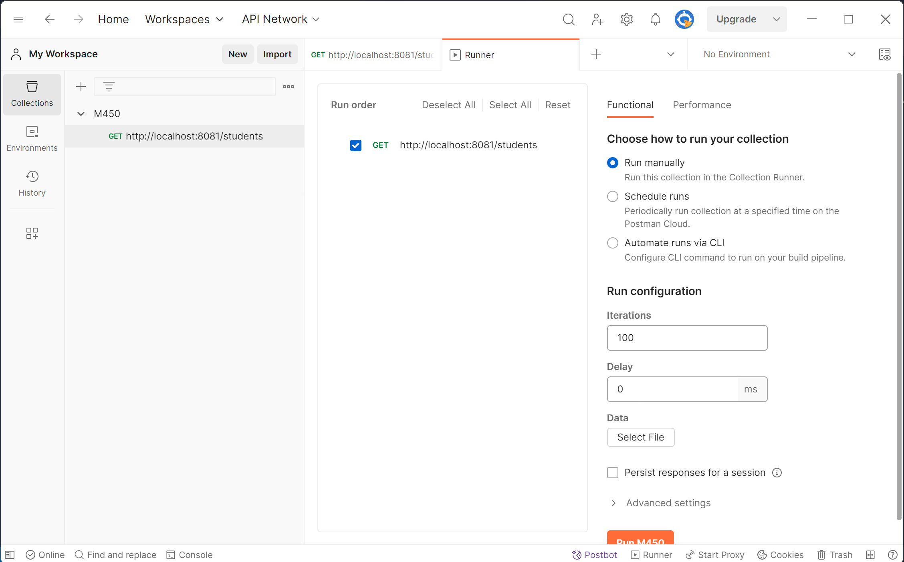
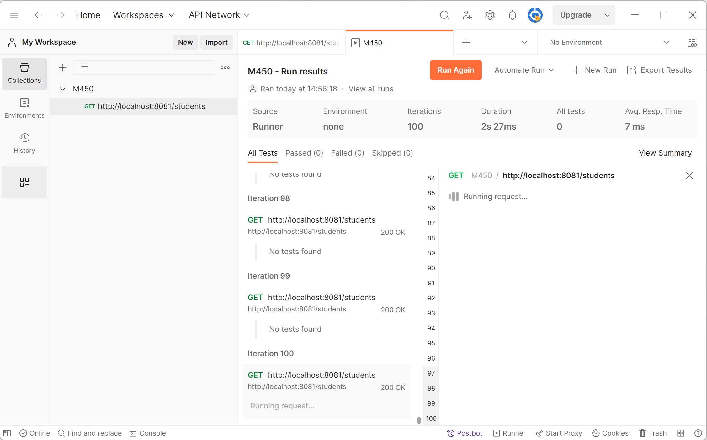

# Aufgabe 3

Ich habe einen Stress-test mit Postman durchgeführt wo ich 100 mal den /student endpoint abgefragt habe:

Alle Tests sind gut durchgelaufen ausser der letzte, der irgendwie abgestürzt ist:
